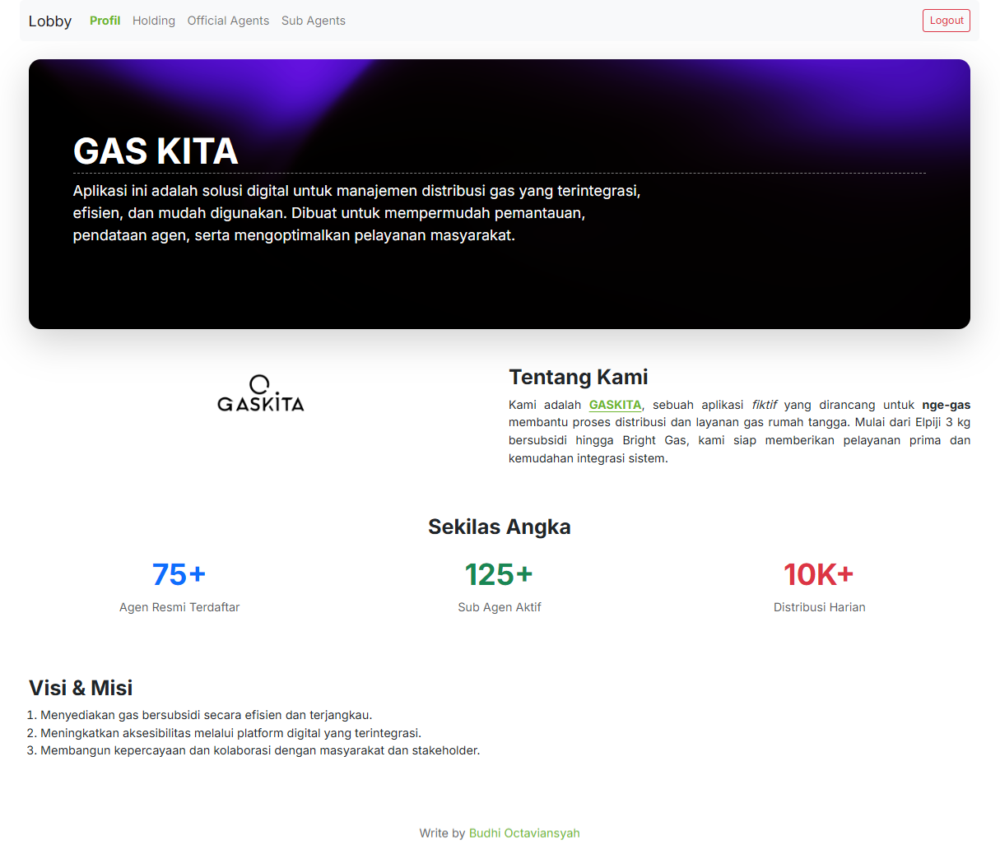
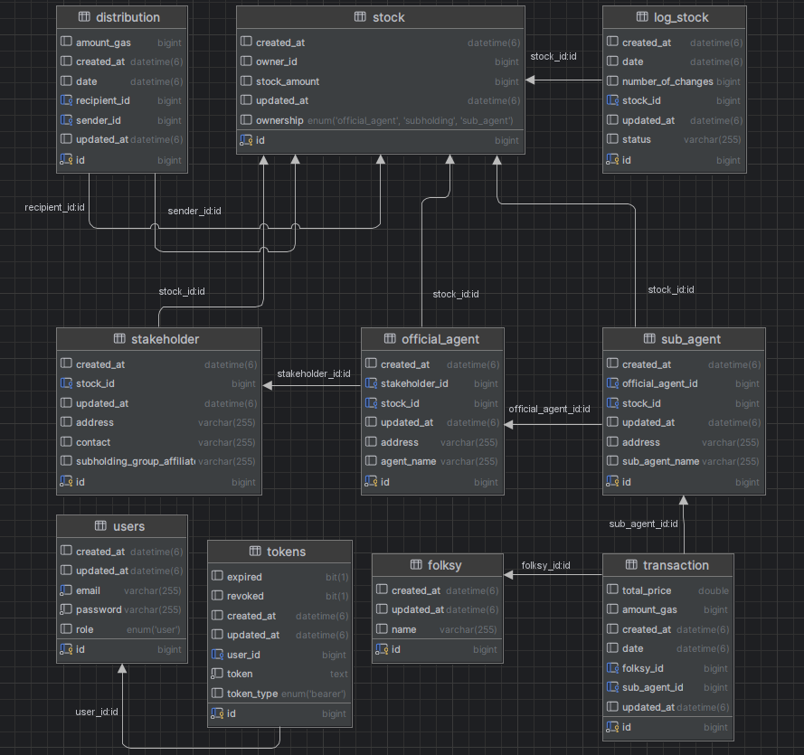

# 🔥 GASKITA – Fullstack Natural Resource Gas Management App

**GASKITA** is a fictional but functional fullstack application designed to help manage the distribution and delivery of household gas — from subsidized 3kg Elpiji to Bright Gas non-subsidized.

> Built using **Java Spring Boot** (Backend) and **Vue.js 3 + Vite** (Frontend).

---

## 🖼️ App Preview

<div align="center">
  
</div>

---

## ✨ What is GASKITA?

GASKITA is a simple digital platform that makes gas distribution easier and more organized. It helps track gas stock, manage agents, and handle distribution from Holding (Sub-Holding) to Official Agents to Sub Agents to local communities.

**Goals:**
- 📦 Easy gas stock monitoring
- 🧾 Agent and sub-agent data tracking
- 🚚 Distribution management from stakeholders to the public

---

## ⚙️ Tech Stack

| Backend (Java)           | Frontend (Vue.js)        |
|--------------------------|--------------------------|
| Java 21                  | Vue.js 3                 |
| Spring Boot 3            | Vite                     |
| Spring Security + JWT    | Bootstrap 5              |
| Spring Validation        | Axios                    |
| MySQL                    | Node.js & npm            |
| Maven                    |                          |

---

## ✅ Main Features

- 🔐 JWT authentication and secure login
- 🧑‍💼 Stakeholder management (e.g., production units)
- 🏪 Official agent distribution
- 👨‍👩‍👧‍👦 Sub-agent gas selling to communities
- 📊 Transaction history
- ⚠️ Clean error handling with JSON responses

---

## 🗃️ Entity Relationship Diagram (ERD)

<div align="center">
  
</div>

---

## 🚀 Installation Guide

1. Clone the repository
   ```bash
   git clone https://github.com/budioct/gaskita-natural-resource-gas.git
   ```

2. Create MySQL database
    ```sql
    CREATE DATABASE db_natural_gas;
    ```

3. Update DB config (backend)
   Edit `src/main/resources/application.properties` and update:
   ```properties
   spring.datasource.username=YOUR_USERNAME
   spring.datasource.password=YOUR_PASSWORD
   ```

4. Build and run the backend
   ```bash
   mvn clean install
   mvn spring-boot:run
   ```
   Runs on: `http://localhost:8080`


5. Install frontend dependencies
   ```bash
   cd frontend/
   npm install
   ```

6. Run frontend app
   ```bash
   npm run dev
   ```
   Runs on: `http://localhost:5173`

---

## 🧪 Demo Accounts

**Register account:**
```txt
Email   : budhioct@test.com
Password: password
Role    : user
```

**Login with demo user:**
```txt
Email   : budhioct@test.com
Password: password
```

---

## 📮 API Docs

- Postman link: *coming soon*
- Postman collection is available inside the `docs/` folder

---

## 🙌 About the Creator

Hi, I'm **<a href="https://www.linkedin.com/in/budhi-octaviansyah/"> Budhi Octaviansyah </a>** 👋

This project is built as a learning journey to explore fullstack development using Spring Boot and Vue.js. It’s a simple app, but it shows how a clean and connected system can work in real life.

> Thanks for checking out GASKITA! I hope it inspires or helps you build better systems too. Feel free to fork or give feedback!

---

🚀 Happy coding and stay energized! – <a href="https://www.linkedin.com/in/budhi-octaviansyah/"> Budhi Octaviansyah </a>

